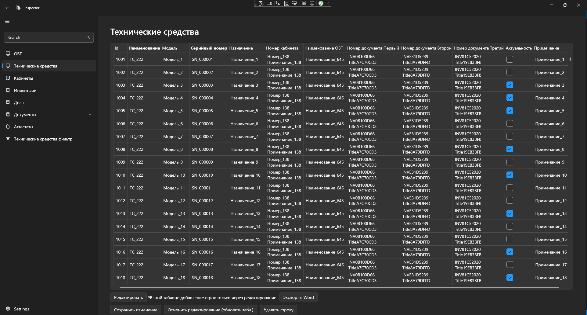
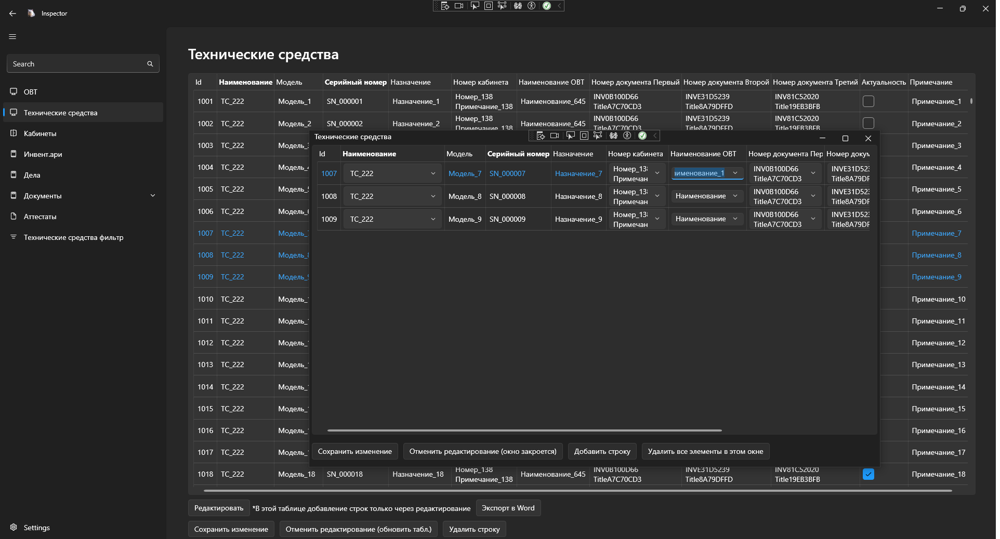
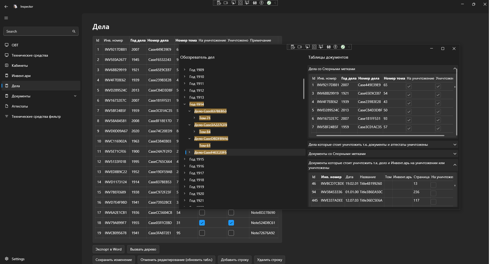
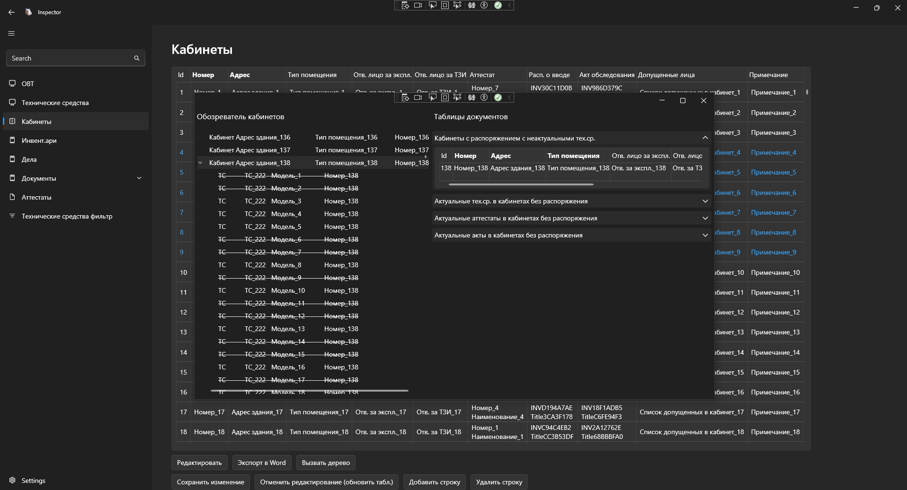
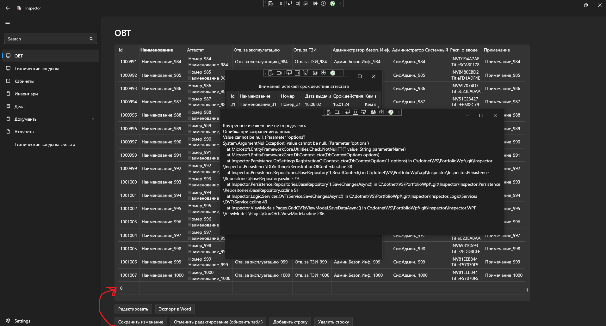
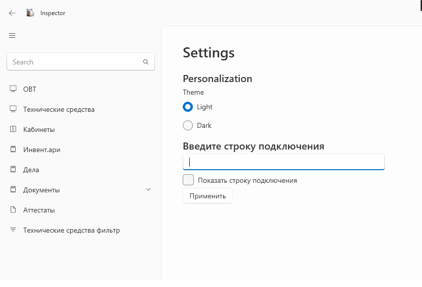

# PortfolioWpf

Привет! Меня зовут Юля. Я начинающий разработчик C# Backend. Этот репозиторий содержит приложение, которое я разработала, изучая различные стороны программирования на C#.

### WPF-приложение для инвентаризации и планирования в ПАО Сбербанк

**Описание:**
Разработка приложения для инвентаризации технических средств, помещений и документов, а также планирования работ подразделения на базе MS SQL и Entity Framework.

**Задачи:**
- Разработка интерфейса и функционала для управления инвентаризацией.
- Переработка проекта с учетом архитектурных принципов и внедрение зависимостей.
- Оптимизация базы данных и улучшение производительности приложения.

### Трудности, с которыми я столкнулась

- Самостоятельное проектирование архитектуры базы данных, пользовательского интерфейса, на основании пожеланий пользователей.

- С увеличением объема данных возникли проблемы с производительностью SQL-запросов и стабильностью приложения, особенно при работе с большими наборами данных. Трудности добавляла невозможность получить точный фитбек о проблемах от реальных пользователей тк. доступа к реальной базе данных у меня не было и логи писать было нельзя. Перешла на асинхронные методы, чтобы смоделировать поведение приложения и выявить причины замедления, сгенерировала тестовые данные и провела оптимизацию SQL-запросов. 

- Зависание WPF-форм при работе с большими наборами данных. Формы, отображающие большие коллекции данных, зависали при взаимодействии. Реализованы оптимизации с использованием кэширования форм и коллекций, а также улучшены методы отображения данных, чтобы минимизировать нагрузку на интерфейс.

- Конфликт контекстов при внедрении зависимости (Dependency Injection) в WPF. При переходе на архитектуру с правильным использованием DI (паттерн Scoped для сервисов репозитория), общий контекст базы данных использовался для всех форм, что приводило к проблемам с откатом транзакций. Это не позволяло выполнять параллельные действия в разных формах. Проблема была решена путем корректной настройки жизненного цикла сервисов в приложении.

- Отсутствие явных ошибок в XAML. Часто XAML не указывал на ошибки в коде, что приводило к некорректной работе приложения без каких-либо сообщений об ошибках на этапе разработки.

- Проблемы с совместимостью при обновлении фреймворка WPF. После обновления фреймворка некоторые пространства имен и стили приложения (например, изменения в механизме изменения цвета) изменились, что не приводило к ошибкам на этапе компиляции, но вызывало некорректную работу приложения. 

Данный проект создан для резюме и предназначен исключительно для ознакомительного просмотра. Пожалуйста, обратите внимание, что этот репозиторий не предназначен для использования в коммерческих или производственных целях. Многие поля и функции изменены для данного репозитория, чтобы избежать проблем с коммерческой тайной. Размещение этого репозитория согласовано с Центром специальной работы ПАО Сбербанк.
